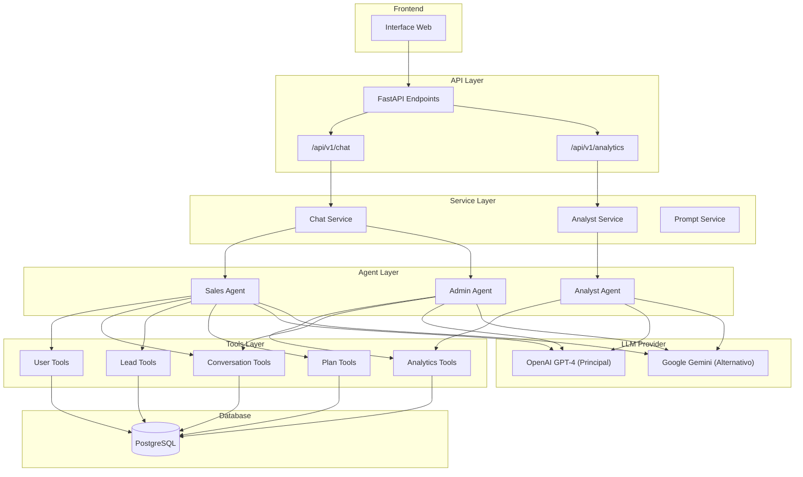
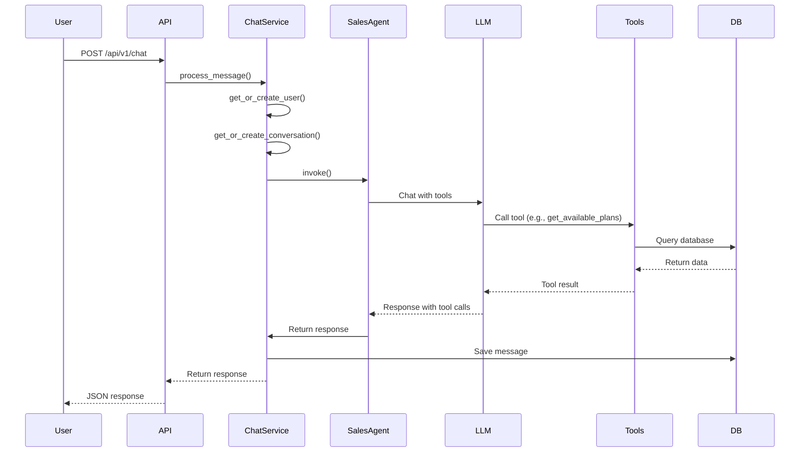
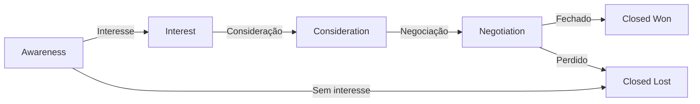

# WorkHub AI Sales System

Sistema completo de vendas com IA para espaços de coworking, implementando agentes inteligentes (Vendas, Analista e Admin) usando **FastAPI + LangChain + OpenAI**.

## ⚡ Início Rápido

```bash
# 1. Clone o repositório
git clone <repository-url>
cd teste_bluelephant-morphia

# 2. Configure o .env com sua chave OpenAI
cp env.example .env
# Edite .env e adicione: OPENAI_API_KEY=sk-your-key-here

# 3. Execute o Docker
docker-compose up --build

# 4. Aguarde o seed automático (acontece no startup)
# 5. Acesse http://localhost:8000/chat
```

**⚠️ Requisitos:** Docker, Docker Compose e conta OpenAI com API Key.

## 📋 Sobre o Projeto

Este projeto demonstra uma arquitetura robusta de agentes de IA com **Function Calling/Tools** para interação estruturada com banco de dados PostgreSQL.

### Agentes Disponíveis

- **Sales Agent**: Conversar com clientes, recomendar planos, superar objeções e fechar vendas
- **Analyst Agent**: Analisar conversas, identificar padrões, calcular métricas e sugerir melhorias
- **Admin Agent**: Acesso administrativo para análise de vendas, gestão de leads e métricas detalhadas

### Domínio de Negócio: WorkHub Coworking

WorkHub é um espaço de coworking fictício com 3 planos:
- **Day Pass** (R$ 49/dia): Acesso por 1 dia
- **Flex** (R$ 497/mês): 10 dias de acesso por mês
- **Dedicado** (R$ 897/mês): Acesso ilimitado 24/7

## 🏗️ Arquitetura

### Stack Tecnológica

- **Backend**: Python 3.11+, FastAPI
- **IA/LLM**: LangChain, OpenAI GPT-4 (Google Gemini como alternativa)
- **Banco de Dados**: PostgreSQL (Async)
- **ORM**: SQLAlchemy 2.0 (Async)
- **Migrations**: Alembic
- **Testes**: Pytest, Pytest-Asyncio
- **Containerização**: Docker, Docker Compose

### Diagrama de Arquitetura



### Fluxo de Conversa



### Funil de Vendas



## 🚀 Quick Start

### ⚠️ Pré-requisitos

Antes de começar, certifique-se de ter:

1. **Docker e Docker Compose instalados**
   - Docker Desktop: https://www.docker.com/products/docker-desktop
   - Ou Docker Engine + Docker Compose
   - Verifique a instalação: `docker --version` e `docker-compose --version`

2. **Conta OpenAI com API Key**
   - Este projeto foi desenvolvido para usar **OpenAI** como provider principal
   - Crie uma conta em: https://platform.openai.com
   - Obtenha sua API Key em: https://platform.openai.com/api-keys
   - Você precisará de créditos na conta OpenAI para usar a API

### 1. Clone o Repositório

```bash
git clone <repository-url>
cd teste_bluelephant-morphia
```

### 2. Configure o Arquivo `.env`

Crie um arquivo `.env` na raiz do projeto. Você pode usar o arquivo de exemplo:

```bash
# Linux/Mac
cp env.example .env

# Windows (PowerShell)
Copy-Item env.example .env
```

Ou crie manualmente o arquivo `.env` com o conteúdo abaixo.

Edite o arquivo `.env` e adicione sua chave da OpenAI:

```env
# OpenAI (REQUERIDO - Provider principal do projeto)
OPENAI_API_KEY=sk-your-openai-api-key-here
OPENAI_MODEL=gpt-4o-mini

# Provider LLM (padrão: openai)
LLM_PROVIDER=openai

# Database (já configurado para Docker - ALTERE EM PRODUÇÃO)
DATABASE_URL=postgresql+asyncpg://workhub:workhub123@db:5432/workhub_db

# Ambiente
APP_ENV=development
LOG_LEVEL=INFO
```

**⚠️ IMPORTANTE:**
- O projeto foi desenvolvido para usar **OpenAI** como provider principal
- Você precisa de uma API Key válida da OpenAI
- Obtenha sua chave em: https://platform.openai.com/api-keys
- O modelo padrão é `gpt-4o-mini` (mais econômico)
- Você pode usar `gpt-4o` ou `gpt-3.5-turbo` se preferir

**Exemplo de `.env` completo:**
```env
OPENAI_API_KEY=sk-your-openai-api-key-here
OPENAI_MODEL=gpt-4o-mini
LLM_PROVIDER=openai
DATABASE_URL=postgresql+asyncpg://workhub:workhub123@db:5432/workhub_db
APP_ENV=development
LOG_LEVEL=INFO
AUTO_SEED=true
```

**⚠️ SEGURANÇA:** 
- As credenciais do banco de dados (`workhub123`) são apenas para desenvolvimento local
- **Em produção**, altere todas as senhas e use variáveis de ambiente seguras
- Nunca commite arquivos `.env` com chaves reais no repositório

### 3. Execute o Docker Compose

Inicie todos os serviços (banco de dados + aplicação):

```bash
docker-compose up --build
```

**O que acontece:**
- ✅ Baixa as imagens necessárias (PostgreSQL, Python)
- ✅ Cria e inicia o container do PostgreSQL na porta 5432
- ✅ Cria e inicia o container da aplicação FastAPI
- ✅ Executa as migrations do banco automaticamente
- ✅ Inicia o servidor FastAPI na porta 8000

**⚠️ IMPORTANTE:**
- O primeiro build pode demorar alguns minutos (baixa dependências)
- Aguarde até ver a mensagem de sucesso abaixo
- **Não feche o terminal** - os containers precisam estar rodando

**Aguardar até ver:**
```
workhub_app  | INFO:     Uvicorn running on http://0.0.0.0:8000
workhub_app  | INFO:     Application startup complete.
workhub_app  | INFO:     Checking if database needs seeding...
workhub_app  | INFO:     Database not seeded. Running automatic seed...
workhub_app  | INFO:     ✅ Database automatically seeded on startup
```

**O que acontece automaticamente:**
- ✅ O sistema verifica se o banco já foi populado
- ✅ Se não estiver populado, executa o seed automaticamente
- ✅ Cria 3 planos do WorkHub (Day Pass, Flex, Dedicado)
- ✅ Cria 25 usuários de teste
- ✅ Cria 25 conversas distribuídas pelo funil
- ✅ Cria 15-20 leads qualificados
- ✅ Cria mensagens e objeções de exemplo

**Se houver erros:**
- Verifique se a porta 8000 não está em uso
- Verifique se o Docker está rodando
- Verifique se o arquivo `.env` está configurado corretamente
- Verifique os logs: `docker-compose logs app`

**Nota:** O seed automático pode ser desabilitado definindo `AUTO_SEED=false` no `.env`. Nesse caso, você pode executar manualmente: `docker-compose exec app python -m app.core.seed`

### 4. Acesse o Sistema

- **API Documentation (Swagger)**: http://localhost:8000/docs
- **Interface Web (Frontend)**: http://localhost:8000/chat
- **ReDoc**: http://localhost:8000/redoc

### 5. Teste o Sistema (Opcional)

Execute o script de teste para verificar se tudo está funcionando:

```bash
docker-compose exec app python test_agent_flow.py
```

## 🛠️ Comandos Úteis

### Parar os Containers

```bash
docker-compose down
```

### Ver Logs

```bash
# Todos os serviços
docker-compose logs -f

# Apenas a aplicação
docker-compose logs -f app

# Apenas o banco
docker-compose logs -f db
```

### Reiniciar a Aplicação

```bash
docker-compose restart app
```

### Acessar Shell do Container

```bash
docker-compose exec app bash
```

### Recriar Dados de Teste

O seed é executado automaticamente no startup. Para forçar recriação:

```bash
# Opção 1: Desabilitar auto-seed e executar manualmente
# No .env: AUTO_SEED=false
docker-compose exec app python -m app.core.seed

# Opção 2: Limpar banco e reiniciar (seed automático executará)
docker-compose down -v  # Remove volumes (apaga banco)
docker-compose up --build  # Recria tudo com seed automático
```

## 📡 Principais Endpoints

### Chat

```bash
POST /api/v1/chat
{
  "message": "Olá, quero saber sobre coworking",
  "user_key": "user_123",
  "user_name": "João Silva"  # Opcional
}
```

### Analytics (Admin)

```bash
GET /api/v1/analytics/funnel?user_key=ADMIN_USER
GET /api/v1/analytics/plans-performance?user_key=ADMIN_USER
```

**Nota:** Endpoints de analytics requerem usuário admin (nome contendo "ADMIN").

## 🎯 Agentes e Funcionalidades

### Sales Agent

- Conversa natural com clientes
- Recomenda planos baseado no perfil
- Coleta dados do lead (nome, email, telefone)
- Supera objeções comuns
- Cria leads automaticamente
- Solicita handoff quando apropriado

### Admin Agent

- Acessa métricas do funil de vendas
- Analisa performance de planos
- Lista leads recentes
- Identifica objeções comuns
- Filtra conversas por estágio
- Acesso restrito a usuários admin

### Analyst Agent

- Analisa conversas específicas
- Calcula métricas agregadas
- Identifica padrões e tendências
- Gera insights acionáveis

## 📊 Dados de Teste e Analytics

Para informações detalhadas sobre:
- Dados de teste gerados
- Lógica das funções de analytics
- Como usar cada função

Consulte: **[ANALYTICS.md](ANALYTICS.md)**

## 🧪 Testes

O projeto possui uma suíte completa de testes unitários e de integração, cobrindo todas as funcionalidades principais sem dependência de LLM.

### Estrutura de Testes

```
tests/
├── unit/                    # Testes unitários (sem LLM)
│   ├── test_auth_service.py         # Autenticação e autorização
│   ├── test_prompt_service.py        # Carregamento de prompts
│   ├── test_tools.py                 # Tools básicos (user, plan)
│   ├── test_conversation_tools.py    # Tools de conversação
│   ├── test_lead_tools.py            # Tools de leads
│   ├── test_message_tools.py         # Tools de mensagens
│   ├── test_handoff_tools.py         # Tools de handoff
│   └── test_chat_service.py          # Service de chat (parcial)
└── integration/             # Testes de integração
    ├── test_chat_api.py              # Endpoints de chat
    └── test_handoff.py               # Fluxo de handoff
```

### Executar Testes

```bash
# Todos os testes
docker-compose exec app pytest

# Apenas testes unitários
docker-compose exec app pytest tests/unit/

# Apenas testes de integração
docker-compose exec app pytest tests/integration/

# Com cobertura de código
docker-compose exec app pytest --cov=app --cov-report=html

# Com output detalhado
docker-compose exec app pytest -v

# Teste específico
docker-compose exec app pytest tests/unit/test_auth_service.py

# Teste rápido do sistema (requer LLM configurado)
docker-compose exec app python test_agent_flow.py
```

### Cobertura de Testes

Os testes cobrem:
- ✅ **Services**: Auth, Prompt, Chat (parcial)
- ✅ **Tools**: User, Plan, Conversation, Lead, Message, Handoff
- ✅ **Validações**: UUIDs, entradas, roles, stages
- ✅ **Casos de erro**: Entradas inválidas, recursos não encontrados
- ✅ **Integração**: Endpoints da API, fluxos completos

**Total**: 75+ testes unitários e de integração

### Nota sobre Testes com LLM

Os testes unitários foram projetados para **não depender de LLM**, testando apenas a lógica de negócio, validações e interações com banco de dados. Isso garante:
- Testes rápidos e confiáveis
- Não dependem de API keys externas
- Podem ser executados em CI/CD sem custos
- Focam na lógica do código, não nas respostas do LLM

## 🔧 Estrutura do Projeto

```
.
├── app/
│   ├── api/v1/          # Endpoints REST
│   ├── agents/           # Agentes LangChain
│   ├── tools/            # LangChain Tools
│   ├── services/         # Lógica de negócio
│   ├── models/           # Modelos SQLAlchemy
│   └── core/             # Configurações
├── prompts/              # Templates de prompts
├── frontend/             # Interface web
├── tests/                # Testes
└── alembic/              # Migrations
```

## 🎨 Diferenciais

✅ **Multi-Agente** - Sales, Analyst e Admin agents  
✅ **Function Calling** - Interação estruturada com DB  
✅ **Clean Architecture** - Separação de responsabilidades  
✅ **Async/Await** - Performance otimizada  
✅ **Dockerizado** - Setup simples  
✅ **Frontend Integrado** - Interface web para testes  
✅ **Analytics Completo** - Métricas e insights detalhados  

## 📚 Documentação Adicional

- **[ANALYTICS.md](ANALYTICS.md)** - Dados de teste e funções de analytics
- **[TROUBLESHOOTING.md](TROUBLESHOOTING.md)** - Solução de problemas comuns

## 🔒 Segurança

**⚠️ IMPORTANTE para Produção:**

- Altere todas as senhas padrão (banco de dados, etc.)
- Use variáveis de ambiente seguras
- Nunca commite arquivos `.env` com chaves reais
- Configure HTTPS em produção
- Use secrets management adequado (AWS Secrets Manager, HashiCorp Vault, etc.)
- Revise as permissões de acesso ao banco de dados

## 🤝 Contribuindo

Este é um projeto de demonstração técnica. Sugestões e melhorias são bem-vindas!

## 📝 Licença

Este projeto foi desenvolvido como teste técnico e é de uso livre para fins educacionais.

---

**Tecnologias**: Python, FastAPI, LangChain, **OpenAI** (principal), PostgreSQL, Docker, SQLAlchemy, Pydantic, Pytest

---

## 📝 Nota sobre o Provider LLM

Este projeto foi desenvolvido para usar **OpenAI** como provider principal de IA, conforme solicitado. O sistema suporta Google Gemini como alternativa, mas a configuração padrão e recomendada é OpenAI.

Para usar OpenAI, configure no `.env`:
```env
OPENAI_API_KEY=sk-your-key-here
LLM_PROVIDER=openai
OPENAI_MODEL=gpt-4o-mini  # ou gpt-4o, gpt-3.5-turbo
```
